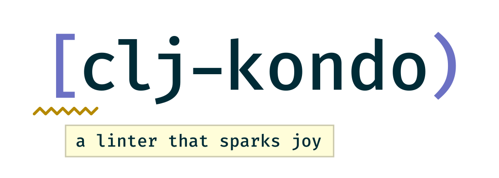
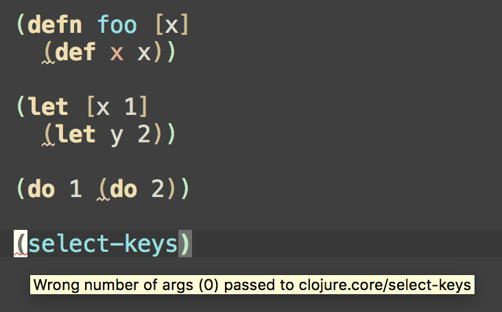
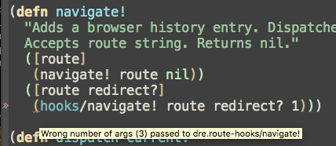

[](https://circleci.com/gh/borkdude/clj-kondo/tree/master)
[](https://ci.appveyor.com/project/borkdude/clj-kondo/branch/master)
[](https://clojars.org/clj-kondo)
[](https://cljdoc.org/d/clj-kondo/clj-kondo/CURRENT)
[](https://clojurians.slack.com/messages/CHY97NXE2)

A linter for Clojure code that sparks joy.



## Rationale

You don't mind the occasional [inline
def](https://blog.michielborkent.nl/2017/05/25/inline-def-debugging/) for
debugging, but you would like to get rid of them before making your code
public. Also, unnecessary `do` and `let` nestings don't really add any value to
your life. Let clj-kondo help you tidy your code.

## Features

clj-kondo detects:

* inline `def` expressions
* redundant `do` and `let` wrappings
* arity errors:
  - within the same namespace and across namespaces
  - of static Java method calls
  - of local `let` and `letfn` binding calls
  - of recursive calls (including `recur`)
* private and deprecated var usage
* required but unused namespaces
* referred but unused vars
* duplicate requires
* unused function arguments and let bindings
* redefined vars
* unresolved symbols
* misplaced docstrings
* duplicate map keys and set elements
* missing map keys
* invalid number of forms in binding vectors
* missing assertions in `clojure.test/deftest`

before your REPL knows it.

It suggests several style guide recommendations, such as:

* rules from Stuart Sierra's [how to ns](https://stuartsierra.com/2016/clojure-how-to-ns.html)
* use `:else` as the catch-all test expression in `cond` (see [Clojure style guide](https://github.com/bbatsov/clojure-style-guide#else-keyword-in-cond))
* use `seq` instead of `(not (empty? ,,,))` (see [Clojure style guide](https://github.com/bbatsov/clojure-style-guide#nil-punning))



It has support for syntax of commonly used macros like
`clojure.core.async/alt!!`, `schema.core/defn` and `potemkin/import-vars`.

It provides [analysis data](analysis) so you build your own custom linters.

This linter is:

* compatible with `.clj`, `.cljs`, `.cljc` and `.edn` files
* build tool and editor agnostic
* a static code analyzer
* compiled to native code using GraalVM

Try clj-kondo at the [interactive playground](https://clj-kondo.michielborkent.nl).

## [Installation](doc/install.md)

## [Running on the JVM](doc/jvm.md)

## [Running with Docker](doc/docker.md)

## Usage

### Command line

Lint from stdin:

``` shellsession
$ echo '(def x (def x 1))' | clj-kondo --lint -
<stdin>:1:8: warning: inline def
```

Lint a file:

``` shellsession
$ echo '(def x (def x 1))' > /tmp/foo.clj
$ clj-kondo --lint /tmp/foo.clj
/tmp/foo.clj:1:8: warning: inline def
```

Lint a directory:

``` shellsession
$ clj-kondo --lint src
src/clj_kondo/test.cljs:7:1: warning: redundant do
src/clj_kondo/calls.clj:291:3: error: Wrong number of args (1) passed to clj-kondo.calls/analyze-calls
```

Lint a project classpath:

``` shellsession
$ clj-kondo --lint "$(lein classpath)"
```

## Project setup

To detect lint errors across namespaces in your project, a cache is needed. To
let clj-kondo know where to create one, make a `.clj-kondo` directory in the
root of your project, meaning on the same level as your `project.clj`,
`deps.edn` or `build.boot`. A cache will be created inside of it when you run
`clj-kondo`.  Before linting inside your editor, it is recommended to lint the
entire classpath to teach `clj-kondo` about all the libraries you are using,
including Clojure and/or ClojureScript itself:

``` shellsession
$ clj-kondo --lint "<classpath>"
```

Build tool specific ways to get a classpath:
- `lein classpath`
- `boot with-cp -w -f`
- `clojure -Spath`

So for `lein` the entire command would be:

    $ clj-kondo --lint "$(lein classpath)"

Now you are ready to lint single files using [editor
integration](doc/editor-integration.md). A simulation of what happens when you
edit a file in your editor:

``` shellsession
$ echo '(select-keys)' | clj-kondo --lang cljs --lint -
<stdin>:1:1: error: Wrong number of args (0) passed to cljs.core/select-keys
```

Since clj-kondo now knows about your version of ClojureScript via the cache,
it detects that the number of arguments you passed to `select-keys` is
invalid. Each time you edit a file, the cache is incrementally updated, so
clj-kondo is informed about new functions you just wrote.

If you want to use a different directory to read and write the cache, use the
`--cache-dir` option. To disable the cache even if you have a `.clj-kondo`
directory, use `--cache false`.

## [Configuration](doc/config.md)

## [Editor integration](doc/editor-integration.md)

## Exit codes

- `0`: no errors or warnings were found
- `2`: more than one warning was found
- `3`: more than one error was found

All other error codes indicate an unexpected error.

## [Analysis data](analysis)

## Tests

    script/test

## [Building from source](doc/build.md)

## Thanks to:

- [joker](https://github.com/candid82/joker) for inspiration
- [rewrite-clj](https://github.com/xsc/rewrite-clj) for the Clojure parser code
- [eastwood](https://github.com/jonase/eastwood) for `var-info.edn` and inspiration
- [contributors](https://github.com/borkdude/clj-kondo/graphs/contributors) and
  other users posting issues with bug reports and ideas
- [Nikita Prokopov](https://github.com/tonsky) for the logo

## Support this project

Do you enjoy this project? Consider buying me a [hot
beverage](https://ko-fi.com/borkdude).

## License

Copyright © 2019 Michiel Borkent

Distributed under the EPL License, same as Clojure. See LICENSE.

The directory `inlined` contains source from [`tools.reader`](https://github.com/clojure/tools.reader) which is licensed under the EPL license.

The directory `parser` contains modified source from [`rewrite-clj`](https://github.com/xsc/rewrite-clj) which is licensed under the MIT license.
