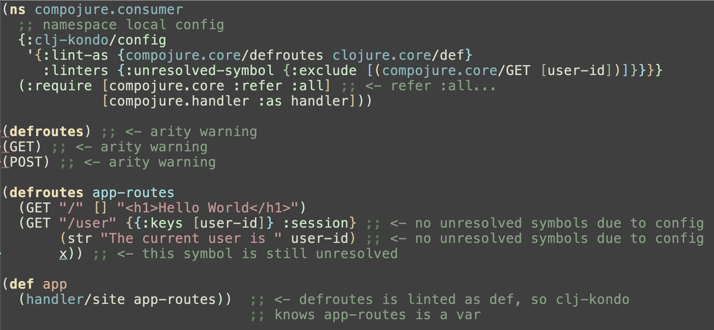

# Configuration

Clj-kondo can be configured in four ways, by providing:

- a `config.edn` file in the `.clj-kondo` directory (see [project setup](../README.md#project-setup))
- a `--config` file argument from the command line
- a `--config` EDN argument from the command line (see examples below)
- a namespace local configuration using `:clj-kondo/config` metadata in the namespace form

<!--  -->

Config takes precedence in the order of namespace, command line,
`.clj-kondo/config.edn`. Note that not all linters are currently supported in
namespace local configuration. Also note that namespace local config must always be quoted.

Look at the [default configuration](../src/clj_kondo/impl/config.clj) for all
available options.

- [Linters](#linters)
- [Output](#output)

## Linters

### Disable a linter

``` shellsession
$ echo '(select-keys [:a])' | clj-kondo --lint -
<stdin>:1:1: error: wrong number of args (1) passed to clojure.core/select-keys
linting took 10ms, errors: 1, warnings: 0

$ echo '(select-keys [:a])' | clj-kondo --lint - --config '{:linters {:invalid-arity {:level :off}}}'
linting took 10ms, errors: 0, warnings: 0
```

### Enable optional linters

Some linters are not enabled by default. Right now these linters are:

- `:missing-docstring`: warn when public var doesn't have a docstring.

You can enable these linters by setting the `:level`:

``` clojure
{:linters {:missing-docstring {:level :warning}}}
```

### Disable all linters but one

You can accomplish this by using `^:replace` metadata, which will override
instead of merge with other configurations:

``` shellsession
$ clj-kondo --lint corpus --config '^:replace {:linters {:redundant-let {:level :info}}}'
corpus/redundant_let.clj:4:3: info: redundant let
corpus/redundant_let.clj:8:3: info: redundant let
corpus/redundant_let.clj:12:3: info: redundant let
```

### Lint a custom macro like a built-in macro

In the following code the `my-defn` macro is defined, but clj-kondo doesn't know how to interpret it:

``` clojure
(ns foo)

(defmacro my-defn [name args & body]
  `(defn ~name ~args
     (do (println "hello!")
       ~@body)))

(my-defn foo [x])
```

Hence `(foo 1 2 3)` will not lead to an invalid arity error. However, the syntax
of `my-defn` is a subset of `clojure.core/defn`, so for detecting arity errors
we might have just linted it like that. That is what the following configuration accomplishes:

``` clojure
{:lint-as {foo/my-defn clojure.core/defn}}
```

### Exclude unresolved symbols from being reported

In the following code `streams` is a macro that assigns a special meaning to the symbol `where`, so it should not be reported as an unresolved symbol:

``` clojure
(ns foo
  (:require [riemann.streams :refer [streams]]))

(def email (mailer {:host "mail.relay"
                    :from "riemann@example.com"}))
(streams
  (where (and (= (:service event) “my-service”)
              (= (:level event) “ERROR”))
    ,,,))
```

This is the config for it:

``` clojure
{:linters
  {:unresolved-symbol
    {:exclude [(riemann.streams/streams [where])]}}}
```

To exclude all symbols in calls to `riemann.streams/streams` write `:exclude [(riemann.streams/streams)]`, without the vector.

To exclude a symbol from being reported as unresolved globally in your project, e.g. `foo`, you can use `:exclude [foo]`.

Sometimes vars are introduced by executing macros, e.g. when using [HugSQL](https://github.com/layerware/hugsql)'s `def-db-fns`. You can suppress warnings about these vars by using `declare`. Example:

``` clojure
(ns hugsql-example
  (:require [hugsql.core :as hugsql]))

(declare select-things)

;; this will define a var #'select-things:
(hugsql/def-db-fns "select_things.sql")

(defn get-my-things [conn params]
  (select-things conn params))
```

Furthermore, the `:lint-as` option can help treating certain macros like built-in ones. This is in clj-kondo's own config:

``` clojure
:lint-as {me.raynes.conch/programs clojure.core/declare
          me.raynes.conch/let-programs clojure.core/let}
```

and helps preventing false positive unresolved symbols in this code:

``` clojure
(ns foo (:require [me.raynes.conch :refer [programs let-programs]]))

(programs rm mkdir echo mv)
(let-programs [clj-kondo "./clj-kondo"]
  ,,,)
```

### Exclude arity linting inside a specific macro call

Some macros rewrite their arguments and therefore can cause false positive arity
errors. Imagine the following silly macro:

``` clojure
(ns silly-macros)

(defmacro with-map [m [fn & args]]
  `(~fn ~m ~@args))
```

which you can call like:

``` clojure
(silly-macros/with-map {:a 1 :d 2} (select-keys [:a :b :c])) ;;=> {:a 1}
```

Normally a call to this macro will give an invalid arity error for `(select-keys
[:a :b :c])`, but not when you use the following configuration:

``` clojure
{:linters {:invalid-arity {:skip-args [silly-macros/with-map]}}}
```

### Exclude required but unused namespace from being reported

In the following code, the namespaces `foo.specs` and `bar.specs` are only loaded for the side effect of registering specs, so we don't like clj-kondo reporting those namespaces as required but unused.

``` clojure
(ns foo (:require [foo.specs] [bar.specs]))
(defn my-fn [x] x)
```

That can be done using this config:

``` clojure
{:linters {:unused-namespace {:exclude [foo.specs bar.specs]}}}
```

A regex is also supported:

``` clojure
{:linters {:unused-namespace {:exclude [".*\\.specs$"]}}}
```

This will exclude all namespaces ending with `.specs`.

### Exclude unused referred vars from being reported.

Imagine you want to have `taoensso.timbre/debug` available in all of your
namespaces. Even when you don't use it, you don't want to get a warning about
it. That can be done as follows:

``` clojure
{:linters {:unused-referred-var {:exclude {taoensso.timbre [debug]}}}}
```

### Exclude deprecated var usage from being reported

Say you have the following function:

``` clojure
(ns app.foo)
(defn foo {:deprecated "1.9.0"} [])
```

and you still want to be able to call it without getting a warning, for example in function in the same namespace which is also deprecated:

``` clojure
(defn bar {:deprecated "1.9.0"} []
  (foo))
```

or in test code:

``` clojure
(ns app.foo-test
  (:require
   [app.foo :refer [foo]]
   [clojure.test :refer [deftest is]]))

(deftest foo-test [] (is (nil? (foo))))
```

To achieve this, use this config:

``` clojure
{:linters
 {:deprecated-var
  {:exclude
   {app.foo/foo
    {:defs [app.foo/bar]
     :namespaces [app.foo-test]}}}}}
```

A regex is also permitted, e.g. to exclude all test namespaces:

``` clojure
{:linters {:deprecated-var {:exclude {app.foo/foo {:namespaces [".*-test$"]}}}}}
```

### Exclude unused bindings from being reported

To exclude unused bindings from being reported, start their names with
underscores: `_x`. To exclude warnings about key-destructured function arguments, use:

``` clojure
{:linters {:unused-binding {:exclude-destructured-keys-in-fn-args true}}}
```

Examples:

``` clojure
$ echo '(defn f [{:keys [:a :b :c]} d])' | clj-kondo --lint -
<stdin>:1:18: warning: unused binding a
<stdin>:1:21: warning: unused binding b
<stdin>:1:24: warning: unused binding c
<stdin>:1:29: warning: unused binding d
linting took 8ms, errors: 0, warnings: 4
```

``` clojure
$ echo '(defn f [{:keys [:a :b :c]} _d])' | clj-kondo --lint - --config \
  '{:linters {:unused-binding {:exclude-destructured-keys-in-fn-args true}}}'
linting took 8ms, errors: 0, warnings: 0
```

### Exclude unused private vars from being reported

Example code:

``` clojure
(ns foo) (defn- f [])
```

Example config:

``` clojure
{:linters {:unused-private-var {:exclude [foo/f]}}}
```

### Alias consistency

Sometimes it's desirable to have a consistent alias for certain namespaces in a project. E.g. in the below code it could be desirable if every alias for `old.api` was `old-api`:

``` clojure
(ns foo (:require [new.api :as api]))
(ns bar (:require [old.api :as old-api]))
(ns baz (:require [old.api :as api]))
```

This configuration:

``` clojure
{:linters {:consistent-alias {:aliases {old.api old-api}}}}
```

will give this warning:

``` clojure
Inconsistent alias. Expected old-api instead of api.
```

### Ignore the contents of comment forms

If you prefer not to lint the contents of `(comment ...)` forms, use this configuration:

```clojure
{:skip-comments true}
```

## Output

### Print results in JSON format


``` shell
$ clj-kondo --lint corpus --config '{:output {:format :json}}' | jq '.findings[0]'
{
  "type": "invalid-arity",
  "filename": "corpus/nested_namespaced_maps.clj",
  "row": 9,
  "col": 1,
  "level": "error",
  "message": "wrong number of args (2) passed to nested-namespaced-maps/test-fn"
}
```

Printing in EDN format is also supported.

### Include and exclude files from the output

``` shellsession
$ clj-kondo --lint "$(clj -Spath)" --config '{:output {:include-files ["^clojure/test"]}}'
clojure/test.clj:496:6: warning: redundant let
clojure/test/tap.clj:86:5: warning: redundant do
linting took 3289ms, errors: 0, warnings: 2

$ clj-kondo --lint "$(clj -Spath)" --config '{:output {:include-files ["^clojure/test"] :exclude-files ["tap"]}}'
clojure/test.clj:496:6: warning: redundant let
linting took 3226ms, errors: 0, warnings: 1
```

### Show progress bar while linting

``` shellsession
$ clj-kondo --lint "$(clj -Spath)" --config '{:output {:progress true}}'
.................................................................................................................
cljs/tools/reader.cljs:527:9: warning: redundant do
(rest of the output omitted)
```

### Output canonical file paths

The config `'{:output {:canonical-paths true}}'` will output canonical file
paths (absolute file paths without `..`). This also shows the full path of a jar
file when you lint a classpath.

``` shellsession
$ clj-kondo --lint corpus --config '{:output {:canonical-paths true}}'
/Users/borkdude/dev/clj-kondo/corpus/cljc/datascript.cljc:8:1: error: datascript.db/seqable? is called with 2 args but expects 1
(rest of the output omitted)
```

## Example configurations

These are some example configurations used in real projects. Feel free to create a PR with yours too.

- [clj-kondo](https://github.com/borkdude/clj-kondo/blob/master/.clj-kondo/config.edn)
- [rewrite-cljc](https://github.com/lread/rewrite-cljs-playground/blob/master/.clj-kondo/config.edn)
