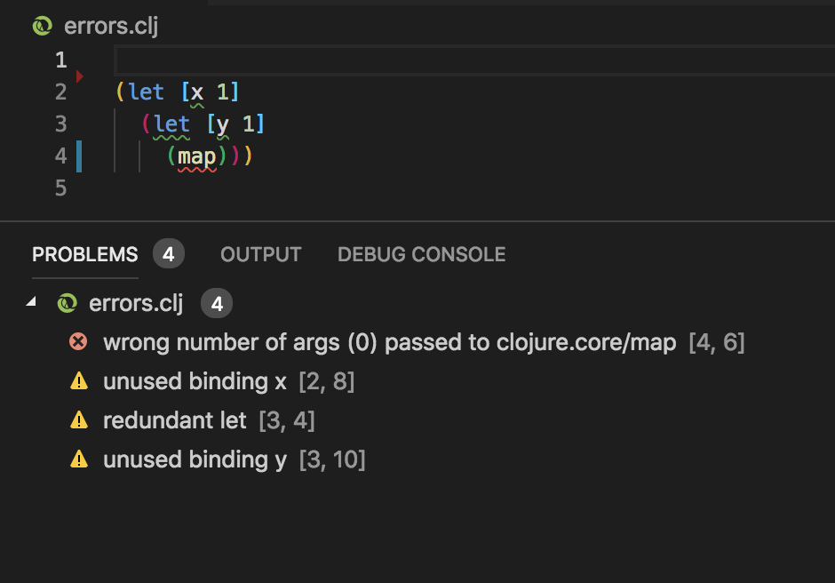
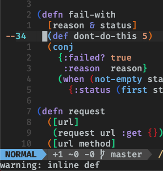
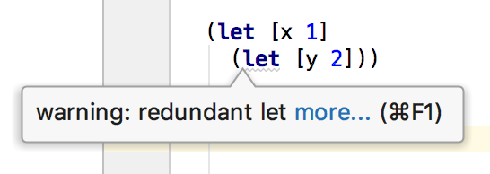
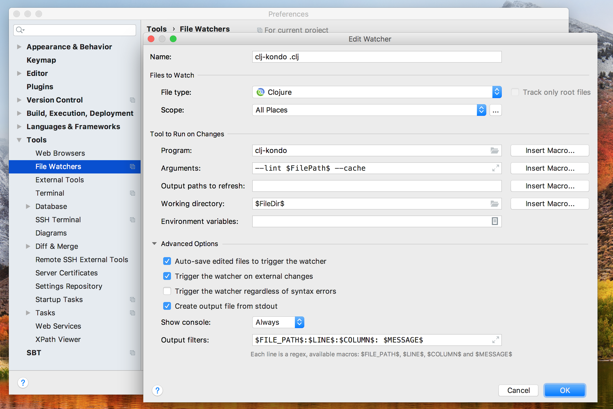

# Editor integration

Before setting up your editor, see [Project setup](../README.md#project-setup)
on how to configure `clj-kondo` for your project. TL;DR: this involves creating
a `.clj-kondo` directory in the root of your project.

## Emacs

For integrating with Emacs, see
[flycheck-clj-kondo](https://github.com/borkdude/flycheck-clj-kondo).

For Spacemacs, check [here](#spacemacs).

## Visual Studio Code

In Visual Studio Code, go to Preferences > Extensions. Search for 'clojure lint' and select the 'Clojure Lint' extension by [@marcomorain](https://github.com/marcomorain/clojure-lint). Click 'install'. That's it.



## Atom

Atom requires clj-kondo to be on your `$PATH`. In Atom, there are a few ways to install:

1. `apm install linter-kondo linter linter-ui-default intentions bsusy-signal`
2. Install from the [Atom package](https://atom.io/packages/linter-kondo) page.
3. From inside Atom, go to Preferences > Extensions. Search for "linter-kondo" and click "Install" on the extension.

## Vim / Neovim

### ALE

This section is for Vim 8+ or Neovim.

1. Install [ALE](https://github.com/w0rp/ale) using your favorite plugin
   manager. This already has in-built support for clj-kondo.
2. In your `.vimrc`, add:

   ``` viml
   let g:ale_linters = {'clojure': ['clj-kondo']}
   ```

   to only have clj-kondo as the linter.

   To enable both clj-kondo and joker, add:

   ``` viml
   let g:ale_linters = {'clojure': ['clj-kondo', 'joker']}
   ```

3. Reload your `.vimrc` and it should start working.



### Vanilla way

Create this file in `~/.config/nvim/compiler/clj-kondo.vim` or `~/.vim/compiler/clj-kondo.vim`.

``` viml
if exists("current_compiler")
  finish
endif
let current_compiler="clj-kondo"

if exists(":CompilerSet") != 2
  command -nargs=* CompilerSet setlocal <args>
endif

CompilerSet errorformat=%f:%l:%c:\ Parse\ %t%*[^:]:\ %m,%f:%l:%c:\ %t%*[^:]:\ %m
CompilerSet makeprg=clj-kondo\ --lint\ %
```

#### Usage

You can populate the quickfix list like so:

```
:compiler clj-kondo
:make
```

See [romainl's vanilla linting](https://gist.github.com/romainl/ce55ce6fdc1659c5fbc0f4224fd6ad29) for how to automatically execute linting and automatically open the quickfix.

If you have [vim-dispatch](https://github.com/tpope/vim-dispatch/) installed, you can use this command to be both async and more convenient:

```
:Dispatch -compiler=clj-kondo
```

## IntelliJ IDEA



This section assumes that you are already using
[Cursive](https://cursive-ide.com).

1. Install the [File
Watchers](https://www.jetbrains.com/help/idea/settings-tools-file-watchers.html)
plugin.

Repeat the below steps for the file types Clojure (`.clj`), ClojureScript (`.cljs`)
and CLJC (`.cljc`).

2. Under Preferences / Tools / File Watchers click `+` and choose the `<custom>`
   template.
3. Choose a name. E.g. `clj-kondo <filetype>` (where `<filetype>` is one of
   Clojure, ClojureScript or CLJC).
4. In the File type field, choose the correct filetype.
5. In the Program field, type `clj-kondo`.
6. In the Arguments field, type `--lint $FilePath$ --cache`.
7. In the Working directory field, type `$FileDir$`.
8. Enable `Create output file from stdout`
9. In output filters put `$FILE_PATH$:$LINE$:$COLUMN$: $MESSAGE$`.



## Spacemacs

Ensure that:

1. `syntax-checking` is present in `dotspacemacs-configuration-layers`.
2. `clj-kondo` is available on PATH.

In the `.spacemacs` file:

When using the stable `master` branch:

1. In `dotspacemacs-additional-packages` add `flycheck-clj-kondo`.
2. In the `dotspacemacs/user-config` function add the following:

   ``` elisp
   (use-package clojure-mode
    :ensure t
    :config
    (require 'flycheck-clj-kondo))
   ```

To install it alongside joker:

1. In `dotspacemacs-additional-packages` add `flycheck-clj-kondo` and `flycheck-joker`.
2. In the `dotspacemacs/user-config` function add the following:

   ``` elisp
   (use-package clojure-mode
    :ensure t
    :config
    (require 'flycheck-joker)
    (require 'flycheck-clj-kondo)
    (dolist (checker '(clj-kondo-clj clj-kondo-cljs clj-kondo-cljc clj-kondo-edn))
      (setq flycheck-checkers (cons checker (delq checker flycheck-checkers))))
    (dolist (checkers '((clj-kondo-clj . clojure-joker)
                        (clj-kondo-cljs . clojurescript-joker)
                        (clj-kondo-cljc . clojure-joker)
                        (clj-kondo-edn . edn-joker)))
      (flycheck-add-next-checker (car checkers) (cons 'error (cdr checkers)))))
   ```

If using the `develop` branch, clj-kondo is available as a part of the standard
clojure layer. This will become the way to install in the next stable
release of spacemacs.

To enable it:

1. Ensure the clojure layer is in the `dotspacemacs-configuration-layers`.
2. Add a variable called `clojure-enable-linters` with the value `'clj-kondo`.

It should look like this:

```elisp
dotspacemacs-configuration-layers
'(...
    (clojure :variables
             clojure-enable-linters 'clj-kondo)
 )
```

Reload the config to enable clj-kondo.
