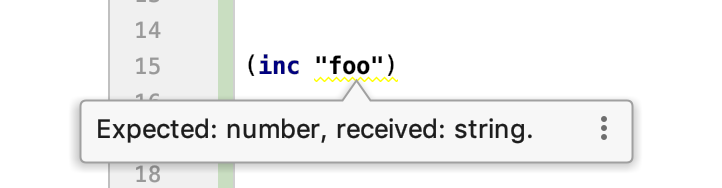
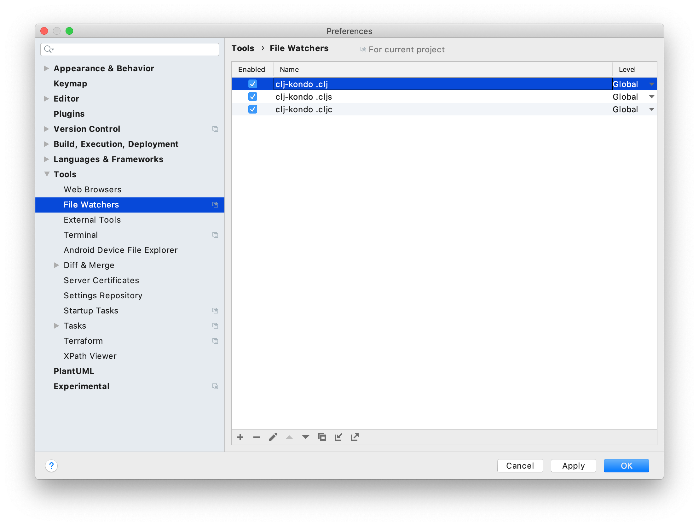

# Editor integration

Before setting up your editor, see [Project setup](../README.md#project-setup)
on how to configure `clj-kondo` for your project. TL;DR: this involves creating
a `.clj-kondo` directory in the root of your project.

## Emacs

For integrating with Emacs, see
[flycheck-clj-kondo](https://github.com/borkdude/flycheck-clj-kondo).

For Spacemacs, check [here](#spacemacs) or get [flymake-kondor](https://github.com/turbo-cafe/flymake-kondor) if you are using flymake.

### LSP server

Emacs has the [lsp-mode](https://github.com/emacs-lsp/lsp-mode) where you can configure multiple LSP servers for different programming languages. 
To use `clj-kondo` as an LSP server, you can configure the `lsp-mode` server command to point to the `clj-kondo` lsp-server jar. Note that the LSP server does not provide features other than diagnostics.

1. Download the latest clj-kondo LSP server jar to your system. Go to the
   [Github releases](https://github.com/borkdude/clj-kondo/releases) and look
   for `clj-kondo-lsp-server-<version>-standalone.jar`. The jar is provided
   since version `2019.11.23`.

2. Configure your `lsp-mode` pointing to the clj-kondo lsp server jar that you downloaded, like the example below:

```lisp
(use-package lsp-mode
  :ensure t
  :hook ((clojure-mode . lsp))
  :commands lsp
  :custom
  ((lsp-clojure-server-command '("java" "-jar" "/home/user/clj-kondo/clj-kondo-lsp-server.jar")))
  :config
  (dolist (m '(clojure-mode
               clojurescript-mode))
    (add-to-list 'lsp-language-id-configuration `(,m . "clojure"))))
```

## Visual Studio Code

### clojure-lint extension

Like most editor plugins, the 'Clojure Lint' extension by
[@marcomorain](https://github.com/marcomorain/clojure-lint) uses the installed
version of clj-kondo.  In Visual Studio Code, go to Preferences >
Extensions. Search for 'clojure lint' and select the Click 'install'. That's it.


### clj-kondo extension

The native version of clj-kondo is not well supported yet for Windows
environments due to limitations of GraalVM. If you're using Windows, you can
install the
[clj-kondo](https://marketplace.visualstudio.com/items?itemName=borkdude.clj-kondo)
extension instead. It bundles clj-kondo and requires no additional
installation. Note that this extension is part of
[Calva](https://github.com/BetterThanTomorrow/calva) since v2.0.54.

Despite the native not working well on Windows, users can still have
command-line version of clj-kondo by installing the
[NPM](https://github.com/borkdude/clj-kondo/blob/master/doc/install.md#npm-linux-macos-windows)
package. This invokes the clj-kondo standalone jar.

## Atom

Atom requires clj-kondo to be on your `$PATH`. In Atom, there are a few ways to install:

1. `apm install linter-kondo linter linter-ui-default intentions busy-signal`
2. Install from the [Atom package](https://atom.io/packages/linter-kondo) page.
3. From inside Atom, go to Preferences > Extensions. Search for "linter-kondo" and click "Install" on the extension.

## Vim / Neovim

### ALE

This section is for Vim 8+ or Neovim.

1. Install [ALE](https://github.com/w0rp/ale) using your favorite plugin
   manager. This already has in-built support for clj-kondo.
2. In your `.vimrc`, add:

   ``` viml
   let g:ale_linters = {'clojure': ['clj-kondo']}
   ```

   to only have clj-kondo as the linter.

   To enable both clj-kondo and joker, add:

   ``` viml
   let g:ale_linters = {'clojure': ['clj-kondo', 'joker']}
   ```

3. Reload your `.vimrc` and it should start working.


### Vanilla way

Create this file in `~/.config/nvim/compiler/clj-kondo.vim` or `~/.vim/compiler/clj-kondo.vim`.

``` viml
if exists("current_compiler")
  finish
endif
let current_compiler="clj-kondo"

if exists(":CompilerSet") != 2
  command -nargs=* CompilerSet setlocal <args>
endif

CompilerSet errorformat=%f:%l:%c:\ Parse\ %t%*[^:]:\ %m,%f:%l:%c:\ %t%*[^:]:\ %m
CompilerSet makeprg=clj-kondo\ --lint\ %
```

#### Usage

You can populate the quickfix list like so:

```
:compiler clj-kondo
:make
```

See [romainl's vanilla linting](https://gist.github.com/romainl/ce55ce6fdc1659c5fbc0f4224fd6ad29) for how to automatically execute linting and automatically open the quickfix.

If you have [vim-dispatch](https://github.com/tpope/vim-dispatch/) installed, you can use this command to be both async and more convenient:

```
:Dispatch -compiler=clj-kondo
```

## IntelliJ IDEA

Currently there are two ways to get clj-kondo integration in IntelliJ: via the
clj-kondo LSP server or via the File Watchers plugin.

### LSP server

The LSP server does not provide features other than diagnostics,
so if you are unsure, prefer the File Watchers approach.

1. Download the latest clj-kondo LSP server jar to your system. Go to the
   [Github releases](https://github.com/borkdude/clj-kondo/releases) and look
   for `clj-kondo-lsp-server-<version>-standalone.jar`. The jar is provided
   since version `2019.11.23`.

2. Install the LSP Support plugin by gtache, either from the marketplace of via
   a zipfile downloaded from the a [Github
   release](https://github.com/gtache/intellij-lsp/releases). Version 1.6.0 or
   later is required.



3. Configure the LSP Support plugin.
   - Go to Preferences / Languages & Frameworks / Language Server Protocol / Server definitions. Select
     `Raw command`.
   - In the `Extension` field enter `clj;cljs;cljc;edn`.
   -  In the command field enter `java -jar
      <path>` where `<path>` matches the downloaded
      jar file,
      e.g. `/Users/borkdude/clj-kondo-lsp-server-2019.11.23-standalone.jar`.

Now, when editing a Clojure file, you should get linting feedback.

### File Watchers + installed binary


You do not need any other Clojure plugins like [Cursive](https://cursive-ide.com).
If you have them, they will work fine together.

1. Install the [File Watchers](https://www.jetbrains.com/help/idea/settings-tools-file-watchers.html) plugin. This plugin is available for installation in the Community Edition, even though it is bundled in Ultimate, you don't need Ultimate to install it.

Repeat the below steps for the file types Clojure (`.clj`), ClojureScript (`.cljs`)
and CLJC (`.cljc`)<sup>1</sup>.
Cursive automatically creates these file types,
but if you don't use Cursive, you can still [register clj filetypes](https://www.jetbrains.com/help/idea/creating-and-registering-file-types.html#)<sup>2</sup>.

2. Under Preferences / Tools / File Watchers click `+` and choose the `<custom>`
   template
3. Choose a name. E.g. `clj-kondo <filetype>` (where `<filetype>` is one of
   Clojure, ClojureScript or CLJC)
4. In the File type field, choose the correct filetype
5. Scope: `Current file`
6. In the Program field, type `clj-kondo`
7. In the Arguments field, type `--lint $FilePath$`<br>
You may use a custom config E.g `--lint $FilePath$ --config "{:lint-as {manifold.deferred/let-flow clojure.core/let}}"`.
8. In the Working directory field, type `$FileDir$`
9. Enable `Create output file from stdout`
10. Show console: `Never`
11. In output filters put `$FILE_PATH$:$LINE$:$COLUMN$: $MESSAGE$`
12. Click `ok` and under the newly created file-watcher, change level to `Global` - this will enable the watcher in all future projects


The "level" defaults to "Project". Change it to "Global" so that `clj-kondo` is active for all projects.



<sup>1</sup> See [Reader Conditionals](https://clojure.org/guides/reader_conditionals) for more information on the `.cljc` extension.
CLJX (`.cljx`) is an extension that was used prior to CLJC but is no longer in wide use.

<sup>2</sup> See [File Watchers user guide](https://www.jetbrains.com/help/idea/using-file-watchers.html) for generic usage information for file watcher setup.

## Spacemacs

Ensure that:

1. `syntax-checking` is present in `dotspacemacs-configuration-layers`.
2. `clj-kondo` is available on PATH.

In the `.spacemacs` file:

### Installing on master branch

When using the stable `master` branch:

1. In `dotspacemacs-additional-packages` add `flycheck-clj-kondo`.
2. In the `dotspacemacs/user-config` function add the following:

   ``` elisp
   (use-package clojure-mode
    :ensure t
    :config
    (require 'flycheck-clj-kondo))
   ```

To install it alongside joker:

1. In `dotspacemacs-additional-packages` add `flycheck-clj-kondo` and `flycheck-joker`.
2. In the `dotspacemacs/user-config` function add the following:

   ``` elisp
   (use-package clojure-mode
    :ensure t
    :config
    (require 'flycheck-joker)
    (require 'flycheck-clj-kondo)
    (dolist (checker '(clj-kondo-clj clj-kondo-cljs clj-kondo-cljc clj-kondo-edn))
      (setq flycheck-checkers (cons checker (delq checker flycheck-checkers))))
    (dolist (checkers '((clj-kondo-clj . clojure-joker)
                        (clj-kondo-cljs . clojurescript-joker)
                        (clj-kondo-cljc . clojure-joker)
                        (clj-kondo-edn . edn-joker)))
      (flycheck-add-next-checker (car checkers) (cons 'error (cdr checkers)))))
   ```

### Installing on develop branch

If using the `develop` branch, clj-kondo is available as a part of the standard
clojure layer. This will become the way to install in the next stable
release of spacemacs.

To enable it:

1. Ensure the clojure layer is in the `dotspacemacs-configuration-layers`.
2. Add a variable called `clojure-enable-linters` with the value `'clj-kondo`.

It should look like this:

```elisp
dotspacemacs-configuration-layers
'(...
    (clojure :variables
             clojure-enable-linters 'clj-kondo)
 )
```

Reload the config to enable clj-kondo.

## Kakoune

### Manual Linting

Add the following to `~/.config/kak/kakrc`:

```kak
hook global WinSetOption filetype=clojure %{
    set-option window lintcmd 'clj-kondo --lint'
}
```

The `:lint` command will run `clj-kondo` and annotate the buffer with lint
warnings and errors.

### Automatic Linting on Idle

`clj-kondo` is fast enough to lint as you code!  If you want to do this, use
the following configuration:

```kak
hook global WinSetOption filetype=clojure %{
    set-option window lintcmd 'clj-kondo --lint'
    lint-enable
    hook -group lint-diagnostics window NormalIdle .* %{ lint; lint-show }
}
```

This works well, but tends to clear the message line too frequently.
The following work-around prevents linting from displaying the warning
and error counts on the message line:

```kak
define-command -hidden -override lint-show-counters %{}
```
