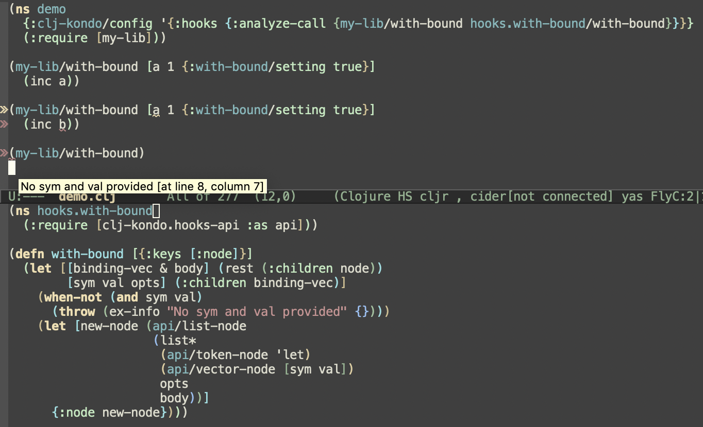
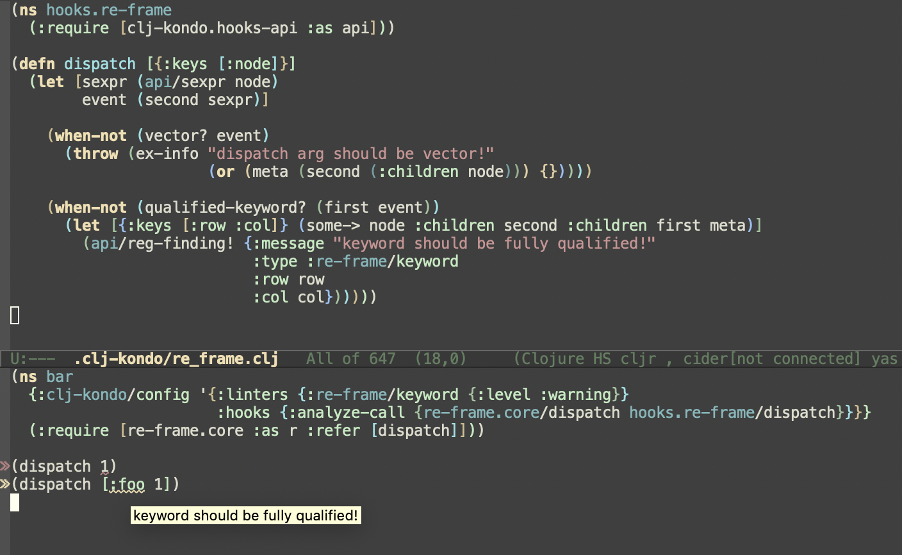

# Hooks

Hooks are a way to enhance linting via user provided code.

## API

Hooks are interpreted using the [Small Clojure Interpreter](https://github.com/borkdude/sci).

Hooks receive Clojure code as rewrite-clj nodes, not only for performance
reasons, but also because rewrite-clj nodes carry the line and row numbers for
every Clojure element.  Note that when we refer to a "rewrite-clj node", we are
referring to clj-kondo's version of rewrite-clj node.  Clj-kondo's version of
[rewrite-clj](https://github.com/xsc/rewrite-clj) is catered to its use case,
includes some bug fixes, but most notably: strips away all whitespace.

A hook can leverage the `clj-kondo.hooks-api` namespace for transformation and analysis of rewrite-clj nodes.

API functions for producing nodes:

- `list-node`: produce a new list node from a seqable of nodes.
- `vector-node`: produce a new vector node from a seqable of nodes.
- `map-node`: produce a new map node from a seqable of nodes
- `keyword-node`: produce a new keyword. Use `(api/keyword-node :foo)` for a
  normal keyword and `(api/keyword-node :foo true)` to produce a node for
  `::foo`.
- `string-node`: produce a new node for a single string or multiple strings (passed as seq)
- `token-node`: produce a new token node. Used for all remaining tokens (mainly used for symbols or nil).

Each producing function has a predicate counterpart for checking a type of node:

- `list-node?`: returns true if given node is a list node
- etc.

Other API functions:

- `sexpr`: turns a node into a Clojure s-expression. Useful for analyzing concrete values.
<!-- - `reg-keyword!`: indicates that a keyword's analysis should be mared as a definition. Expects the keyword node and either true or the fully-qualified call that registered it.-->
- `reg-finding!`: registers a finding. Expects a map with:
  - `:message`: the lint message
  - `:row`, `:col`, `:end-row` and `:end-col`: the location of the finding. These values can be derived from the metadata of a node.
  - `:type`: the type of lint warning. A level must be set for this type in the
    clj-kondo config under `:linters`. If the level is not set, the lint warning
    is ignored.
- `ns-analysis`: Return any cached analysis for the namespace identified by the
  `ns-sym` arg.  Returns a map keyed by language keyword with values being maps
  of var definitions keyed by defined symbol. The value for each symbol is a
  subset of the values provide by the top level `:analysis` option."  Arglists:
  `[ns-sym]`, `[ns-sym {:keys [lang]}]`.

The namespaces `clojure.core`, `clojure.set` and `clojure.string` are also available.
Use `println` or `prn` for debugging and `time` to measure performance.

Hooks must be configured in clj-kondo's `config.edn` under `:hooks`, e.g.:

``` Clojure
{:hooks {:analyze-call {foo.weird-macro hooks.foo/weird-macro}}}
```

## analyze-call

The `analyze-call` hook offers a way to lint macros that are unrecognized by clj-kondo and cannot
be supported by [`:lint-as`](#lint-a-custom-macro-like-a-built-in-macro).

It receives Clojure macro (or function) call code as input in the form of a rewrite-clj node, and can:

- Transform the code to teach clj-kondo about its effect.
- Inspect call arguments and emit findings about them.

## Clojure code as rewrite-clj nodes

If you develop a hook you will likely need some familiarity with rewrite-clj node structure.
A couple of examples might help:

`(my-macro 1 2 3)` becomes:

- a list node with `:children`:
  - token node `my-macro`
  - token node `1`
  - token node `2`
  - token node `3`

`(my-lib/with-bound [a 1 {:with-bound/setting true}] (inc a))` becomes:

- a list node with `:children`
  - token node `my-lib/with-bound`
  - vector node with `:children`
    - token-node `a`
    - token-node `1`
    - map node with `:children`
      - keyword node `:with-bound/setting`
      - token node `true`
  - list node
    - token node `inc`
    - token node `a`

Clj-kondo uses a different approach to metadata than the original rewrite-clj
library. Metadata nodes are stored in the `:meta` key on nodes correponding to
the values carrying the metadata:

`^:foo ^:bar []` becomes:

- a vector node with `:meta`
  - a seq of nodes with:
    - keyword node `:foo`
    - keyword node `:bar`


### Transformation

As an example, let's take this macro:

``` clojure
(ns mylib)
(defmacro with-bound [binding-vector & body] ,,,)
```

Users can call this macro like so:

``` clojure
(require '[my-lib])
(my-lib/with-bound [a 1 {:with-bound/setting true}] (inc a))
```

Clj-kondo does not recognize this syntax and will report the symbol `a` as
unresolved. If the macro didn't expect an option map in the third position of
the binding vector, we could have used `:lint-as {my-lib.with-bound
clojure.core/let}`, but unfortunately that doesn't work for this macro. We will
now write a hook that transforms the call into:

``` clojure
(let [a 1] {:with-bound/setting true} (inc a))
```

It is not important that the code is rewritten exactly according to the
macroexpansion. What counts is that the transformation rewrites into code that
clj-kondo can understand.

This is the code for the hook:

``` clojure
(ns hooks.with-bound
  (:require [clj-kondo.hooks-api :as api]))

(defn with-bound [{:keys [:node]}]
  (let [[binding-vec & body] (rest (:children node))
        [sym val opts] (:children binding-vec)]
    (when-not (and sym val)
      (throw (ex-info "No sym and val provided" {})))
    (let [new-node (api/list-node
                    (list*
                     (api/token-node 'let)
                     (api/vector-node [sym val])
                     opts
                     body))]
      {:node new-node})))
```

This code will be placed in a file `hooks/with_bound.clj` in your `.clj-kondo`
directory.

To register the hook, use this configuration:

``` clojure
{:hooks {:analyze-call {my-lib/with-bound hooks.with-bound/with-bound}}}
```

The symbol `hooks.with-bound/with-bound` corresponds to the file
`.clj-kondo/hooks/with_bound.clj` and the `with-bound` function defined in
it. Note that the file has to declare a namespace corresponding to its directory
structure and file name, just like in normal Clojure.

An analyze-call hook function receives a `:node` in its argument map. This is a
rewrite-clj node representing the hooked Clojure macro (or function) call code
clj-kondo has found in the source code it is linting. The hook uses the
`clj-kondo.hooks-api` namespace to validate then rewrite this node into a new
rewrite-clj node:

1. The `with-bound` hook function checks if the call has at least a `sym` and `val`
node. If not, it will throw an exception, which will result in a clj-kondo warning.

2. As a last step, the hook function constructs a new node using `api/list-node`,
`api/token-node` and `api/vector-node`. This new node is returned in a map under
the `:node` key.

Now clj-kondo fully understands the `my-lib/with-bound` macro and you will no
longer get false positives when using it. Moreover, it will report unused
bindings and will give warnings customized to this macro.

<p align="center">
  
</p>

### Custom lint warnings

Analyze-call hooks can also be used to create custom lint warnings, without
transforming the original rewrite-clj node.

This is done either by simply throwing an error within the hook, or instead 
calling `reg-finding!`. They are similar, but the latter allows for defining 
precise details, including naming the linter type and defining the range to
report the diagnostics for (eg where to render "squigglies").

This is an example for re-frame's `dispatch` function which checks if the
dispatched event used a qualified keyword.

``` clojure
(ns hooks.re-frame
  (:require [clj-kondo.hooks-api :as api]))

(defn dispatch [{:keys [:node]}]
  (let [sexpr (api/sexpr node)
        event (second sexpr)
        kw (first event)]
    (when (and (vector? event)
               (keyword? kw)
               (not (qualified-keyword? kw)))
      (let [m (some-> node :children second :children first meta)]
        (api/reg-finding! (assoc m :message "keyword should be fully qualified!"
                                 :type :re-frame/keyword))))))
```

The hook uses the `api/sexpr` function to convert the rewrite-clj node into a
Clojure s-expression, which is easier to analyze. In case of an unqualified
keyword we register a finding with `api/reg-finding!` which has a `:message`,
and `:type`. The `:type` should also occur in the clj-kondo configuration with a
level set to `:info`, `:warning` or `:error` in order to appear in the output:

``` clojure
{:linters {:re-frame/keyword {:level :warning}}
 :hooks {:analyze-call {re-frame.core/dispatch hooks.re-frame/dispatch}}}
```

The hook can access `config` to check if a warning should be emitted.

``` clojure
{:linters {:foo/lint-bar {:level :warning
                          :lint [:a :b]}}
 :hooks {:analyze-call {foo/bar hooks.foo/bar}}}
```
The configuration is supplied as a key in the hook argument:

``` clojure
(ns hooks.foo
  (:require [clj-kondo.hooks-api :as api]))

(defn warn? [linter-params]
  ...)

(defn bar [{:keys [:node :config]}]
  (let [linter-params (-> config :linters :foo/lint-bar :lint)]
    (when (warn? linter-params)
      (api/reg-finding! (assoc (meta node)
                               :message "warning message!"
                               :type :re-frame/keyword)))))
```

Additionally, the finding has `:row`, `:col`, `:end-row` and `:end-col`, derived
from the node's metadata to show the finding at the appropriate location.



## Macroexpand

The `:macroexpand` hook can be used to expand the s-expression representation of
the rewrite-clj nodes using a macro in the configuration. After macroexpansion,
clj-kondo coerces the s-expression back into rewrite-clj nodes. That makes this
feature easier to use than `:analyze-call`, but comes at the cost of loss of
precision with respect to locations: some lint warnings will be reported at a
parent node location. Similar rules to `:analyze-hook` apply to this feature:
the macro in the config doesn't have to be the same as the original macro, as
long as it expands in syntactically sane expressions. The config macros, like
`:analyze-call` hooks, are running in SCI and have a subset of Clojure
available.

Let's illustrate the `:macroexpand` hook using an example. Consider this script
with a macro that causes unresolved symbols:

``` clojure
(ns script)
(def sh (js/require "shelljs"))

(defmacro $ [op & args]
  (list* (symbol (str "." op)) 'sh args))

(prn (str ($ which "git"))) ;; which is unresolved
(prn (str ($ pwd))) ;; pwd is unresolved
($ cd  "..") ;; cd is unresolved
(-> ($ ls) prn) ;; ls is unresolved
```

Place the macro in a similar named namespace in your config directory:

.clj-kondo/script.clj
``` clojure
(ns script)

(defmacro $ [op & args]
  (list* (symbol (str "." op)) 'sh args))
```

Note: the namespace in `.clj-kondo` doesn't have to have the same name but in
general this will work better for the macro expansion.

Configure the macro to be used for expansion. On the left hand side of the map
you use the fully qualified names of the original macros. On the right hand side
you use the fully qualified names of the macros in the config. In this example
they are the same.

.clj-kondo/config.edn:
``` clojure
{:hooks {:macroexpand {script/$ script/$}}}
```

This should get rid of the unresolved symbols.

### Subtleties of `:macroexpand`

There are several special cases to watch out for when using the `:macroexpand` feature.

- It is recommended to put your macroexpansion code into a file / namespace
  with the same name as the original macro.  E.g., if your macro `foo` is
  defined in a namespace named `bar` then the `(defmacro foo ...)` must sit in
  the file `.clj-kondo/bar.clj`.  Furthermore, if the namespace is `my-app.bar`,
  then the macro must be defined in the file `.clj-kondo/my_app/bar.clj`.

  - If the macro depends on aliases in the original namespace, it is recommended
    to fully qualify those aliases in the config macro: instead of writing 
    ```
    `(set/union ...)
    ```

    where `set` is an alias for `clojure.set`, write

    ```
    `(clojure.set/union ...)
    ```

## Tips and tricks

Here are some tips and tricks for developing hooks.

### Debugging

For debugging the output of a hook function, you can use `println` or `prn`. To
get a sense of what a newly generated node looks like, you can use `(prn (api/sexpr node))`.

### Developing hooks in the REPL

For developing hooks in a JVM REPL, clj-kondo exposes the `clj-kondo.hooks-api`
namespace:

``` Clojure
$ clj
Clojure 1.11.0
user=> (require '[clj-kondo.hooks-api :as api])
nil
user=> (defn my-hook [{:keys [node]}] {:node (api/list-node (list* (rest (:children node))))})
#'user/my-hook
```

The JVM namespace exposes additional functions for development:

- `parse-string`: parses an s-expression to a node

``` Clojure
user=> (def node (api/parse-string "(+ 1 2 3)"))
#'user/node
user=> (str (:node (my-hook {:node node})))
"(1 2 3)"
```

To load hook code that is in a `.clj-kondo` directory, not on the classpath, you
can use `load-file` and then test the hook function. Suppose there is a file
`.clj-kondo/hooks/one_of.clj`:

``` Clojure
(ns hooks.one-of
  (:require [clj-kondo.hooks-api :as api]))

(defn one-of [{:keys [node]}]
  (let [[matchee matches] (rest (:children node))
        new-node (api/list-node
                  [(api/token-node 'case)
                   matchee
                   (with-meta (api/list-node (:children matches))
                     (meta matches))
                   matchee])]
    {:node new-node}))

```

Load this file in the JVM repl:

``` Clojure
user=> (load-file ".clj-kondo/hooks/one_of.clj")
#'hooks.one-of/one-of
```

and then call the hook function:

``` Clojure
user=> (hooks.one-of/one-of {:node (api/parse-string "(one-of x [1 2 3])")})
{:node <list: (case x (1 2 3) x)>}
```

To run clj-kondo on the hook code, use the `clj-kondo.core` namespace:

``` Clojure
user=> (require '[clj-kondo.core :as clj-kondo])
nil
user=> (def code "(require '[clj-kondo.impl.utils :as u]) (u/one-of 1 [1 2 3])")
nil
user=> (:findings (with-in-str code (clj-kondo/run! {:lint ["-"]})))
[]
```

When clj-kondo runs hooks, they are executed in a SCI context. Once a hook
namespace is loaded in the SCI context, it will not be reloaded, for performance
reasons. To facilitate reloading, the JVM hooks API exposes the dynamic var
`*reload*` which can be set to `true`:

``` Clojure
user=> (binding [api/*reload* true]
         (:findings (with-in-str code (clj-kondo/run! {:lint ["-"]}))))
[]
```

The dynamic var should not be set to `true` in production usage.

For `:macroexpand` hooks, the JVM api offers the `api/macroexpand` function. Suppose we have a file `.clj-kondo/hooks/one_of.clj` with a macro:

``` Clojure
(ns hooks.one-of
  (:require [clj-kondo.hooks-api :as api]))

(defmacro one-of [elt coll]
  `(case ~elt ~(seq coll) ~elt nil))
```

You can call `api/macroexpand` like this:

``` Clojure
user=> (str (api/macroexpand #'hooks.one-of/one-of* (api/parse-string "(one-of 1 [1 2 3])") {}))
"(clojure.core/case 1 (1 2 3) 1 nil)"
```

So, provide the macro _var_` as the first argument, a node as the second
argument and bindings (local variables in scope of the macro call) as the third
argument. The return value from the macro call is a node that has been
reconstructed from the s-expression that the macro returned.

### Performance

Less code to process will result in faster linting. If only one hook is used in
certain files and another hook is used in other files, divide them up into
multiple files and namespaces. If the hooks use common code, you can put that in
a library namespace and use `require` to load it from each hook's namespace.

To test performance of a hook, you can write code which triggers the hook and
repeat that expression `n` times (where `n` is a large number like
1000000). Then lint the file with `clj-kondo --lint` and measure
timing. The `time` macro is also available within hooks code.


### Refreshing with tools.namespace

Note: the following refers to `v2022.04.25` and earlier. Newer versions support
the `.clj_kondo` extension for hooks which won't cause any confusion with tools
that try to load `.clj` files.

Out of the box, `tools.namespace/refresh(-all)` will attempt to reload all
namespaces that are in Clojure source files (`.clj` etc.) in _directories_ (i.e.
not jars) on the classpath. As clj-kondo allows defining hooks in `.clj` files,
these will be attempted to be also loaded. This can be problematic as a) these
hooks are normally not intended to be loaded in the project, only in the
clj-kondo process b) they are normally placed in a location different to where
Clojure would expect them based on their namespace name.

Example:

```shell
clj -Srepro -Sdeps \
 '{:deps {org.clojure/tools.namespace {:mvn/version "1.2.0"} seancorfield/next.jdbc {:git/url "https://github.com/seancorfield/next-jdbc/" :git/sha "24bf1dbaa441d62461f980e9f880df5013f295dd"}}}' \
 -M -e "((requiring-resolve 'clojure.tools.namespace.repl/refresh-all))"
```

The above will result in a loading error although the configuration loaded from
the referenced lib is valid according to clj-kondo.

```
Could not locate
  hooks/com/github/seancorfield/next_jdbc__init.class,
  hooks/com/github/seancorfield/next_jdbc.clj or
  hooks/com/github/seancorfield/next_jdbc.cljc on classpath.
Please check that namespaces with dashes use underscores in the Clojure file name.
```

There is an
existing [ask.clojure question](https://ask.clojure.org/index.php/11434/could-namespace-refresh-sophisticated-directory-filtering)
about this.

A workaround is to explicitly set the directories `tools.namespace` will search
for Clojure namespaces using `clojure.tools.namespace.repl/set-refresh-dirs`.

To try and still be as broad as possible with the search (as is the default),
the following could be an option:

```clojure
(defn remove-clj-kondo-exports-from-tools-ns-refresh-dirs
  "A potential issue from using this is that if the directory containing the clj-kondo.exports folder
  also directly contains to-be-reloaded clojure source files, those will no longer be reloaded."
  []
  (->> (clojure.java.classpath/classpath-directories)
       (mapcat
        (fn [^File classpath-directory]
          (let [children   (.listFiles classpath-directory)
                directory? #(.isDirectory ^File %)
                clj-kondo-exports?
                           #(= "clj-kondo.exports" (.getName ^File %))
                has-clj-kondo-exports
                           (some (every-pred clj-kondo-exports? directory?) children)]
            (if has-clj-kondo-exports
              (->> children
                   (filter directory?)
                   (remove clj-kondo-exports?))
              [classpath-directory]))))
       (apply clojure.tools.namespace.repl/set-refresh-dirs)))

;; call in user.clj
(remove-clj-kondo-exports-from-tools-ns-refresh-dirs)
```

### Compatibility with tools.build compilation

Note: the following refers to `v2022.04.25` and earlier. Newer versions support
the `.clj_kondo` extension for hooks which won't cause any confusion with tools
that try to load `.clj` files.

Similar to the previous point about `tools.namespace`, compiling a project that
has hooks defined in `.clj` files on its classpath with `tools.build` might run
into issues if one wants to let `tools.build` find as many namespaces to
compile as possible (by setting `:src-dirs (:classpath-roots basis)`). See
some discussion about this
in [this Clojurians thread](https://clojurians.slack.com/archives/C02B5GHQWP4/p1651685386479149).

```shell
cat <<EOF > deps.edn
{:deps {seancorfield/next.jdbc
        {:git/url "https://github.com/seancorfield/next-jdbc/"
         :git/sha "24bf1dbaa441d62461f980e9f880df5013f295dd"}}
 :aliases
 {:build
  {:paths []
   :deps
   {io.github.clojure/tools.build {:git/tag "v0.8.2" :git/sha "ba1a2bf"}}}}}
EOF

clj -Srepro -M:build -e \
 "(let [basis ((requiring-resolve 'clojure.tools.build.api/create-basis))] ((requiring-resolve 'clojure.tools.build.api/compile-clj) {:basis basis :src-dirs (:classpath-roots basis) :class-dir \"classes\"}))"
```

Results in:

```
Execution error (FileNotFoundException) at user/eval136$fn (compile.clj:17).
Could not locate hooks/com/github/seancorfield/next_jdbc__init.class,
hooks/com/github/seancorfield/next_jdbc.clj or
hooks/com/github/seancorfield/next_jdbc.cljc on classpath.
Please check that namespaces with dashes use underscores in the Clojure file name.
```

A workaround is to copy and tweak namespace discovery from `tools.build`:

```clojure
(require
 '[clojure.tools.build.api :as b]
 '[clojure.tools.build.tasks.compile-clj :as compile-clj])

(defn with-safe-ns-compile
  "Attempts to obtain a collection of namespaces that are safe to call
  (compile) on and associates it under :ns-compile"
  [{:keys [basis sort] :or {sort :topo} :as compile-clj-opts}]
  (let [clj-paths (mapv b/resolve-path (:classpath-roots basis))]
    (->> (case sort
           :topo (#'compile-clj/nses-in-topo clj-paths)
           :bfs (#'compile-clj/nses-in-bfs clj-paths)
           (throw (ex-info "Invalid :sort in compile-clj task" {:sort sort})))

         ;; Adjust pred to your own needs
         (filterv #(re-find #"^(my-namespace-prefix|other-safe-prefix)\." (name %)))
         (assoc compile-clj-opts :ns-compile))))
```

## Refer to exported config within project

To refer to the exported config for a project within that same project, you can use:

``` Clojure
{:config-paths ["../resources/clj-kondo.exports/org.your/your.lib"]}
```

## Example Hooks

### Libraries

Here are some example hooks from libraries.

- coffi: [defcfn](https://github.com/IGJoshua/coffi/blob/master/resources/clj-kondo.exports/org.suskalo/coffi/hooks/coffi.clj)

More examples of hooks can be found in the [config](https://github.com/clj-kondo/config) project.

### Disrecommend usage of function or macro

`.clj-kondo/config.edn`:

``` Clojure
{:hooks {:analyze-call {clojure.core/eval org.acme.not-recommended/hook}}
 :linters {:org.acme/not-recommended {:level :error}}}
```

`.clj-kondo/org/acme/not_recommended.clj`:

``` Clojure
(ns org.acme.not-recommended
  (:require [clj-kondo.hooks-api :as api]))

(defn hook [{:keys [node]}]
  (let [name (str (first (:children node)))]
    (api/reg-finding!
     (assoc (meta node)
            :message (format "Please don't use %s" name)
            :type :org.acme/not-recommended))))
```

Output when linting:

``` Clojure
(ns app.core)

(eval '(+ 1 2 3))
```

``` shell
src/app/core.clj:3:1: error: Please don't use eval
```

### Finding unused and undefined re-frame subscriptions

See [this](https://github.com/yannvanhalewyn/analyze-re-frame-usage-with-clj-kondo) repo.

Also see this [gist](https://gist.github.com/roman01la/c6a2e4db8d74f89789292002794a7142).

## Clojurists Together

The initial work on hooks was sponsored by [Clojurists
Together](https://www.clojuriststogether.org/) as part of their [Summer of
Bugs](https://www.clojuriststogether.org/news/announcing-summer-of-bugs/)
program.
