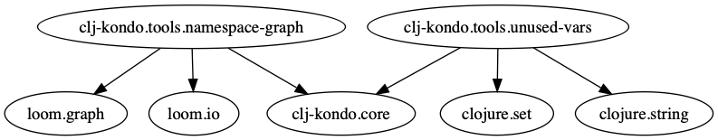

# clj-kondo-tools

Tools leveraging [clj-kondo](https://github.com/borkdude/clj-kondo)'s analysis results.

These are examples of what you can do with the analysis data that clj-kondo
provides while linting your sources.

To run it on your system you will need the Clojure [CLI
tool](https://clojure.org/guides/getting_started) and then use this repo as a
git dep:

    clj -Sdeps '{:deps {:clj-kondo-tools {:git/url "https://github.com/borkdude/clj-kondo-tools" :sha "<latest-sha>"}}}' \
    -m <tool> <args>

where `<latest-sha>` is the latest SHA of this repo.

## Unused vars

``` shellsession
$ clj -m clj-kondo.tools.unused-vars .
The following vars are unused:
clj-kondo.tools.namespace-graph/-main
clj-kondo.tools.unused-vars/-main
```

## Namespace graph

``` shellsession
$ clj -m clj-kondo.tools.namespace-graph .
The following vars are unused:
clj-kondo.tools.namespace-graph/-main
clj-kondo.tools.unused-vars/-main
```



## Find var

``` shellsession
$ clj -m clj-kondo.tools.find-var-usages clj-kondo.core/run! src ../src
clj-kondo.core/run! is defined at ../src/clj_kondo/core.clj:51:7
clj-kondo.core/run! is used at ../src/clj_kondo/main.clj:81:44
clj-kondo.core/run! is used at src/clj_kondo/tools/namespace_graph.clj:7:29
clj-kondo.core/run! is used at src/clj_kondo/tools/find_var_usages.clj:8:29
clj-kondo.core/run! is used at ../src/clj_kondo/core.clj:120:12
clj-kondo.core/run! is used at src/clj_kondo/tools/unused_vars.clj:9:31
```
